# Conociendo el sistema Linux

## Nombre del host:

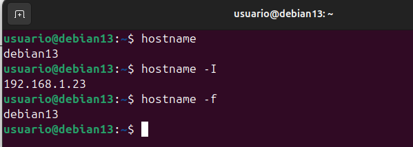

## A partir de ahora: 
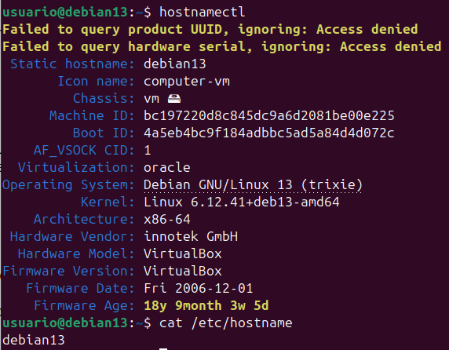

## Cambiar el hostname sin reiniciar:
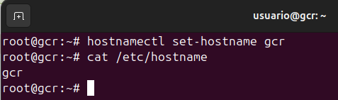

## Versión del sistema:
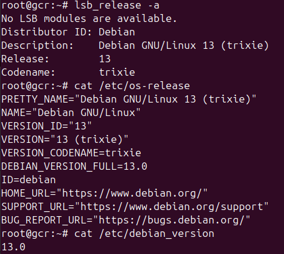

## Memoria RAM:
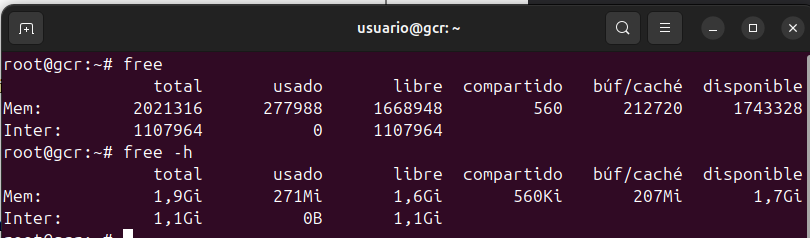

## CPU:
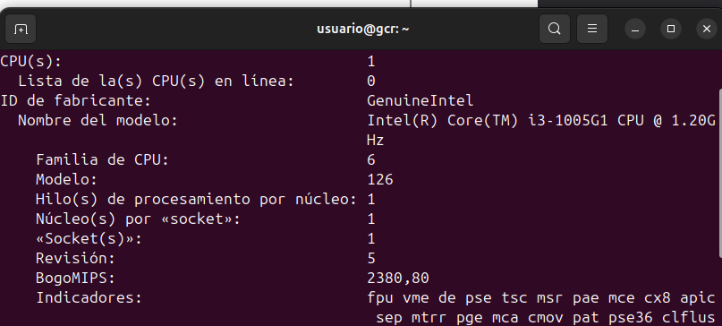
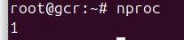

## Versión del núcleo y arquitectura:
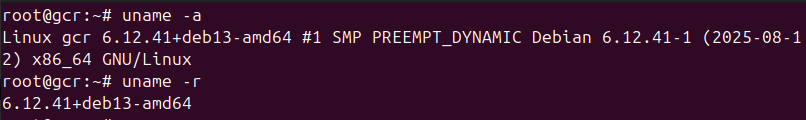

## Discos y particiones:
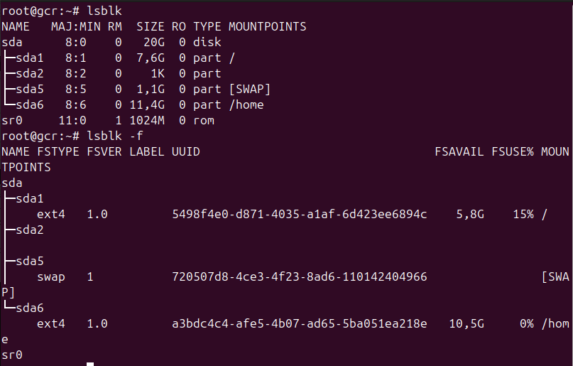
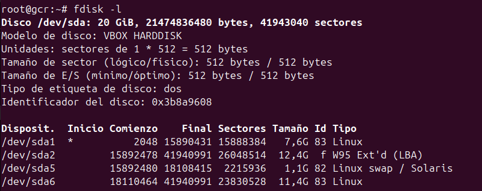

## Sistemas montados

## Tamaño de una carpeta:
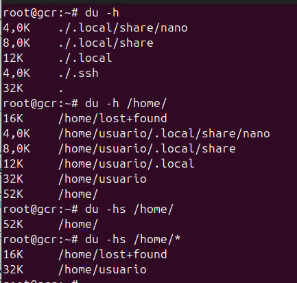

## Usuarios y grupos del sistema:
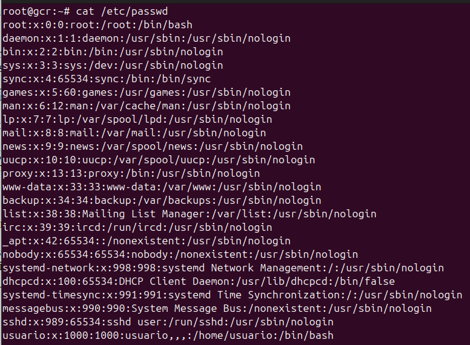
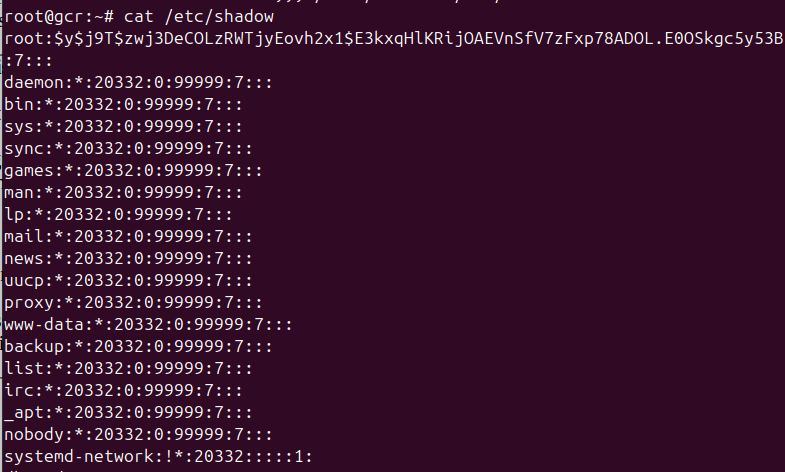
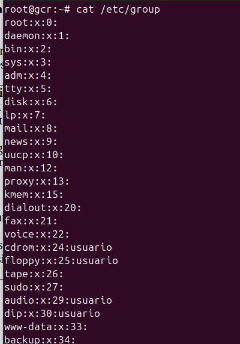
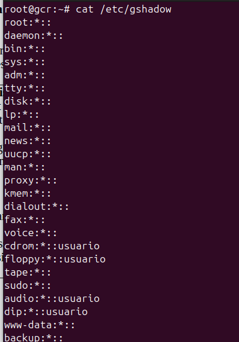
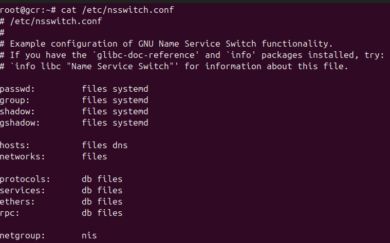

## Información de la red:
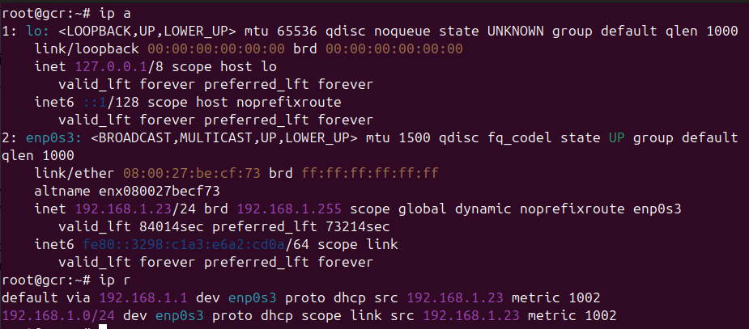
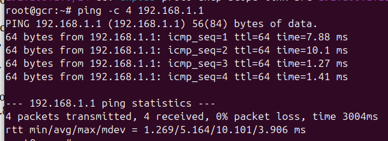
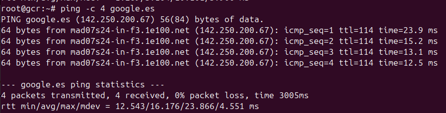
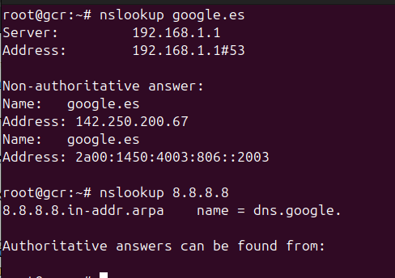

## Configuración de la red:
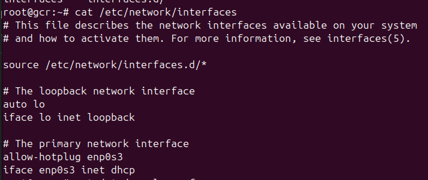

## Configuración tradicional DNS:
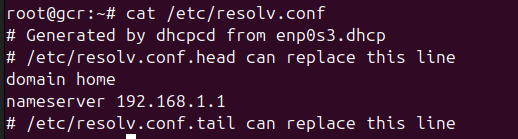

# Reiniciar la red (Debian sin ENTORNO GRÁFICO utiliza networking):
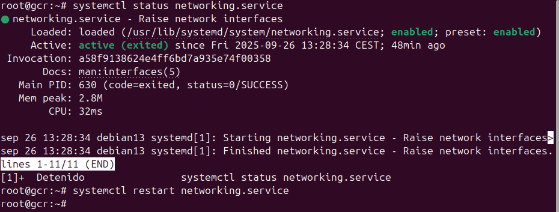

# Si necesitamos bajar o subir una tarjeta de red:
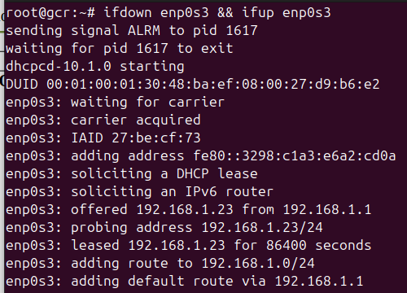

# Configuración de la red: Otra forma:
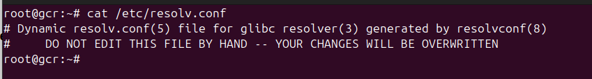
