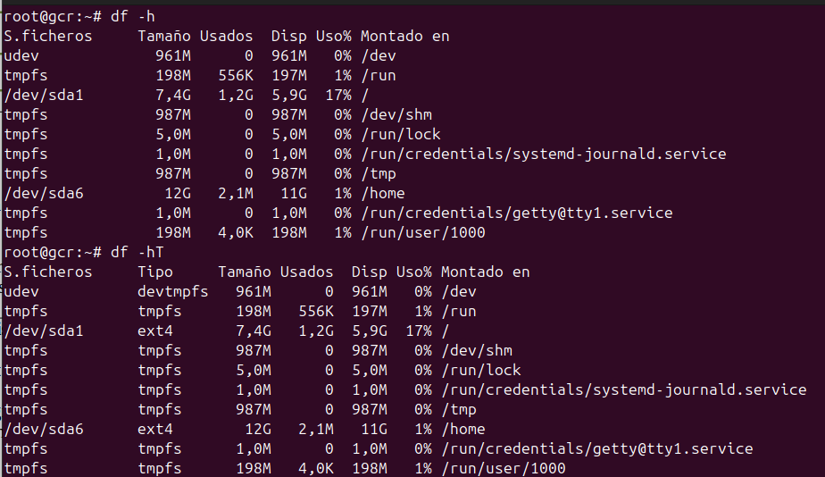

# Conociendo el sistema Linux

## Nombre del host:

## A partir de ahora: 

## Cambiar el hostname sin reiniciar:

## Versión del sistema:

## Memoria RAM:

## CPU:

## Versión del núcleo y arquitectura:

## Discos y particiones:

## Sistemas montados

## Tamaño de una carpeta:

## Usuarios y grupos del sistema:

## Información de la red:

## Configuración de la red:

## Configuración tradicional DNS:

# Reiniciar la red (Debian sin ENTORNO GRÁFICO utiliza networking):

# Si necesitamos bajar o subir una tarjeta de red:

# Configuración de la red: Otra forma:

